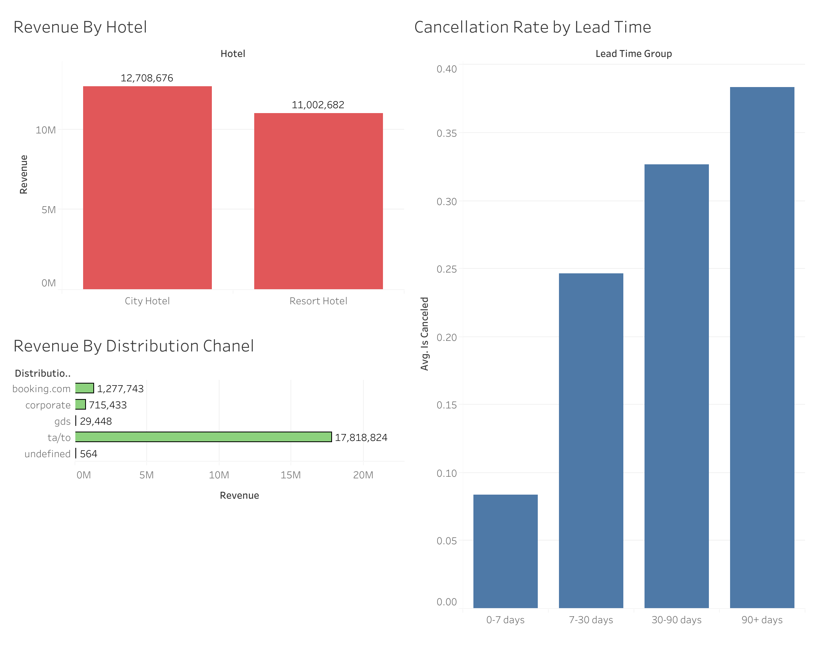

# Hotel Revenue Analysis Project

## Overview

This project analyzes hotel booking and revenue data to identify trends related to:
- cancellations
- revenue generation
- booking channels
- lead time behavior
- customer booking patterns

The project includes:
- data cleaning
- feature engineering
- exploratory data analysis (EDA)
- SQL export
- Tableau-style visual analysis
- basic machine learning for cancellation prediction

---

# Tools & Technologies

- Python
- Pandas
- NumPy
- Matplotlib
- Seaborn
- SQLite
- Scikit-learn

---

# Project Workflow

## 1. Data Cleaning

Several preprocessing steps were performed before analysis:

- handling missing values
- removing duplicates
- fixing inconsistent values
- correcting invalid entries
- standardizing categorical variables

## 2. Feature Engineering

| Feature | Description |
|---|---|
| `total_guests` | Total number of guests per booking |
| `total_nights` | Total nights stayed |
| `total_revenue` | Estimated booking revenue |
| `lead_time_group` | Grouped booking lead time categories |
| `is_family` | Indicates family bookings |

## 3. Exploratory Data Analysis

The analysis explored:
- hotel revenue trends
- cancellation behavior
- booking channels
- seasonal patterns
- ADR (Average Daily Rate)
- lead time impact on cancellations

### Key Insights

- City hotels generated higher total revenue than resort hotels.
- Resort hotels showed lower cancellation rates compared to city hotels.
- Certain distribution channels accounted for the majority of bookings.
- Longer lead times were associated with higher cancellation probability.
- ADR varied significantly depending on hotel type and booking channel.
- A relatively small number of channels generated the majority of total bookings.

---

# Dashboard & Visualization Preview

## Revenue & Cancelation Analysis




The visual analysis focused on:
- revenue distribution
- cancellation trends
- booking channel performance
- lead time analysis
- hotel type comparison

---

# Machine Learning

A simple machine learning classification model was created to predict booking cancellations.

### Features Used
- lead time
- ADR
- hotel type
- booking channel
- customer type
- number of guests

### Model
A Random Forest classification model was trained using Scikit-learn.

### Evaluation

The model demonstrated the ability to identify cancellation patterns based on booking behavior and customer characteristics.

The purpose of the ML section was to demonstrate a basic machine learning workflow:
- preprocessing
- feature encoding
- train/test split
- model training
- prediction
- evaluation


# Limitations

- The dataset represents historical hotel booking data and may not reflect current market conditions.
- Some missing values and inconsistencies required preprocessing and approximation techniques.
- Machine learning performance may be limited by available features and class imbalance.
- Revenue calculations were estimated using available booking information.

# Author

Semyon Sidorov

---

# Project Structure

```text
Hotel_Revenue_Analysis_Project/
│
├── data/
│   ├── raw/
│   └── processed/
│
├── notebooks/
│
├── images/
│
├── README.md
│
└── requirements.txt